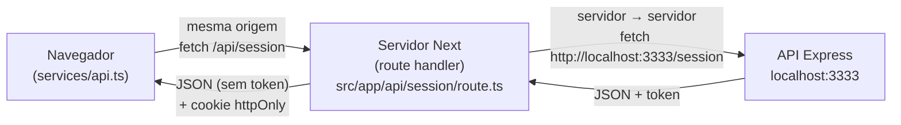
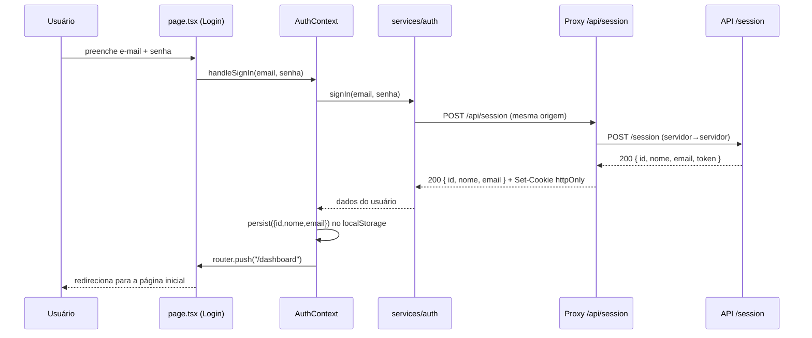
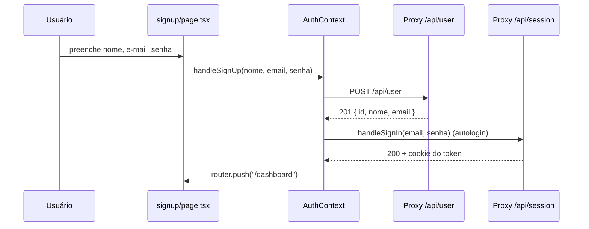

# 🍕 Dudu's Pizzas — Documentação Técnica (Versão Básica)

> **Frontend de autenticação** da pizzaria Dudu's Pizzas.
> Stack: **React + Next.js (App Router) + TypeScript**.
> Escopo desta versão: **cadastro de usuário, login e página inicial**.

| Item | Valor |
|------|-------|
| Nome do pacote | `dudus-pizzas-basico` |
| Framework | Next.js 14.2.x (App Router) |
| Linguagem | TypeScript |
| API consumida | `http://localhost:3333` (Express + Prisma) |
| Porta do frontend | `http://localhost:3000` |
| Público-alvo deste doc | Equipe de desenvolvimento |

---

## Sumário

1. [Visão geral](#1-visão-geral)
2. [Escopo da versão básica](#2-escopo-da-versão-básica)
3. [Stack e dependências](#3-stack-e-dependências)
4. [Decisão de arquitetura: o proxy anti-CORS](#4-decisão-de-arquitetura-o-proxy-anti-cors)
5. [Estrutura de diretórios](#5-estrutura-de-diretórios)
6. [Configuração e variáveis de ambiente](#6-configuração-e-variáveis-de-ambiente)
7. [Camadas do código (arquivo por arquivo)](#7-camadas-do-código-arquivo-por-arquivo)
8. [Contrato com a API](#8-contrato-com-a-api)
9. [Fluxos principais](#9-fluxos-principais)
10. [Sessão e segurança do token](#10-sessão-e-segurança-do-token)
11. [Tratamento de erros](#11-tratamento-de-erros)
12. [Como executar](#12-como-executar)
13. [Convenções e padrões de código](#13-convenções-e-padrões-de-código)
14. [Guia: como adicionar um novo endpoint](#14-guia-como-adicionar-um-novo-endpoint)
15. [Limitações e pontos de atenção](#15-limitações-e-pontos-de-atenção)
16. [Roadmap sugerido](#16-roadmap-sugerido)
17. [Glossário](#17-glossário)

---

## 1. Visão geral

Esta aplicação é o **frontend de autenticação** da Dudu's Pizzas. Ela conversa com uma API
REST (Node/Express + Prisma) que roda separadamente em `localhost:3333`. O usuário pode se
**cadastrar**, **autenticar** e, uma vez logado, acessar a **página inicial** (uma rota
protegida que exibe os dados da sessão).

A principal característica de engenharia do projeto é o uso das **rotas de servidor do Next
(route handlers)** como um *proxy* entre o navegador e a API. Esse padrão resolve, por
construção, o problema de CORS e centraliza o tratamento do token de autenticação.

---

## 2. Escopo da versão básica

### Incluído
- **Login** (`/`) — autenticação via `POST /session`.
- **Cadastro** (`/signup`) — criação de usuário via `POST /user` (com autologin em seguida).
- **Página inicial** (`/dashboard`) — rota protegida; exibe nome e e-mail da sessão e permite logout.

### Fora de escopo (removido nesta versão)
- Cadastro/listagem de categorias.
- Cadastro/listagem de produtos.
- Fluxo de pedidos (abrir mesa, itens, enviar, finalizar).
- Tela de perfil (`/userinfo`).

> Estes módulos existem na versão completa do projeto e podem ser reintroduzidos seguindo o
> mesmo padrão descrito na seção [14](#14-guia-como-adicionar-um-novo-endpoint).

---

## 3. Stack e dependências

### Dependências de produção
| Pacote | Uso |
|--------|-----|
| `next` | Framework (App Router, route handlers, build/prod server) |
| `react` / `react-dom` | Biblioteca de UI |
| `react-icons` | Ícones (conjunto Feather — `fi`) |
| `react-toastify` | Notificações (toasts) de sucesso/erro |

### Dependências de desenvolvimento
| Pacote | Uso |
|--------|-----|
| `typescript` | Tipagem estática |
| `@types/node`, `@types/react`, `@types/react-dom` | Tipos |

### Scripts (`package.json`)
| Script | Comando | Função |
|--------|---------|--------|
| `dev` | `next dev` | Servidor de desenvolvimento com hot-reload |
| `build` | `next build` | Build de produção + checagem de tipos |
| `start` | `next start` | Servidor de produção (requer `build` antes) |
| `lint` | `next lint` | Análise estática |

---

## 4. Decisão de arquitetura: o proxy anti-CORS

### O problema
Se o navegador chamasse `http://localhost:3333` diretamente (origem
`http://localhost:3000` → `http://localhost:3333`), toda requisição seria **cross-origin** e
ficaria sujeita à política de CORS. Sem os cabeçalhos corretos no backend, o navegador bloqueia
a resposta.

### A solução
O navegador **nunca** fala com a API diretamente. Ele chama as **rotas internas do próprio
Next** (`/api/...`), que estão na **mesma origem** da aplicação. É o **servidor do Next** que
encaminha a chamada para a API real. Como a comunicação servidor → servidor não passa pela
política de CORS do navegador, o problema desaparece.



### Benefícios do padrão
- **Sem CORS** no caminho crítico do navegador.
- **Token escondido do JavaScript**: o proxy guarda o token num cookie `httpOnly`, mitigando XSS.
- **Ponto único de manutenção**: os caminhos da API ficam centralizados em `ENDPOINTS`
  (`src/lib/backend.ts`). Mudou um nome de rota no backend? Ajusta-se em um único lugar.
- **Mensagens de erro padronizadas** (API fora do ar, repasse de status etc.).

---

## 5. Estrutura de diretórios

```
dudus-pizzas-basico/
├── package.json
├── next.config.js          # remotePatterns p/ imagens (legado) e strict mode
├── tsconfig.json           # alias "@/*" -> "./src/*"
├── .env.local              # API_URL e NEXT_PUBLIC_API_URL
├── README.md
└── src/
    ├── app/
    │   ├── layout.tsx              # Layout raiz: AuthProvider + ToastContainer
    │   ├── globals.css             # Tema tricolor (branco/vermelho/verde)
    │   ├── page.tsx                # TELA: Login  (rota "/")
    │   ├── signup/
    │   │   └── page.tsx            # TELA: Cadastro (rota "/signup")
    │   ├── dashboard/
    │   │   ├── layout.tsx          # Layout protegido (topbar + logout)
    │   │   └── page.tsx            # TELA: Página inicial (rota "/dashboard")
    │   └── api/                    # PROXIES (servidor) — evitam CORS
    │       ├── session/
    │       │   ├── route.ts        # POST  -> /session  (+ grava cookie do token)
    │       │   └── logout/route.ts # POST  -> limpa o cookie do token
    │       └── user/route.ts       # POST  -> /user
    ├── services/
    │   ├── api.ts                  # Cliente HTTP do navegador (postJson)
    │   └── auth/routes.ts          # signIn / signUp / signOutRequest
    ├── contexts/
    │   └── AuthContext.tsx         # Estado global de autenticação
    ├── components/
    │   └── Brand.tsx               # Logo/marca reutilizável
    └── lib/
        └── backend.ts              # Helpers de servidor + ENDPOINTS
```

### Mapa mental das responsabilidades

| Camada | Onde | Roda em | Responsabilidade |
|--------|------|---------|------------------|
| **Páginas/UI** | `src/app/*/page.tsx`, `layout.tsx` | Navegador | Renderização, formulários, feedback ao usuário |
| **Estado de auth** | `src/contexts/AuthContext.tsx` | Navegador | Sessão, redirecionamentos, persistência do usuário |
| **Serviços (cliente)** | `src/services/**` | Navegador | Funções tipadas que chamam `/api/*` |
| **Proxies** | `src/app/api/**/route.ts` | Servidor Next | Encaminham para a API + cookie do token |
| **Helpers de servidor** | `src/lib/backend.ts` | Servidor Next | URL base, `ENDPOINTS`, chamada resiliente, erros |

---

## 6. Configuração e variáveis de ambiente

Arquivo **`.env.local`** (não versionado):

```env
# Usada no SERVIDOR (pelos proxies em src/app/api). Nunca exposta ao navegador.
API_URL=http://localhost:3333

# Exposta ao navegador (prefixo NEXT_PUBLIC_). Usada apenas para montar URLs de imagem.
NEXT_PUBLIC_API_URL=http://localhost:3333
```

| Variável | Lado | Lida em |
|----------|------|---------|
| `API_URL` | Servidor | `src/lib/backend.ts` → `backendUrl()` |
| `NEXT_PUBLIC_API_URL` | Cliente | Reservada para imagens (não usada nesta versão básica) |

> **Regra do Next:** apenas variáveis com prefixo `NEXT_PUBLIC_` chegam ao navegador. Sem o
> prefixo, a variável fica restrita ao servidor — exatamente o que queremos para `API_URL`.

O **alias de import** `@/*` (em `tsconfig.json`) aponta para `./src/*`. Por isso usamos
`import { api } from "@/services/api"` em vez de caminhos relativos.

---

## 7. Camadas do código (arquivo por arquivo)

### 7.1. `src/lib/backend.ts` — helpers de servidor

Módulo executado **somente no servidor**. Concentra três responsabilidades:

**a) `ENDPOINTS`** — o mapa central dos caminhos da API. **É aqui que se ajusta qualquer
divergência de nomes de rota** com o backend.

```ts
export const ENDPOINTS = {
  session: "/session",
  user: "/user",
} as const;
```

**b) `callBackend(path, init)`** — faz `fetch` para a API de forma resiliente. Em vez de deixar
a rota quebrar com 500 quando a API está fora do ar, captura o erro e devolve um resultado
estruturado:

```ts
type ApiResult = { ok: boolean; status: number; data: any; networkError: boolean };
```

**c) Respostas padronizadas:**
- `apiUnreachable(path)` → **HTTP 502** com mensagem clara ("A API não respondeu em …").
- `passthroughError(path, result, fallback)` → repassa o **status original** da API e, **em
  desenvolvimento**, anexa um campo `_debug` com a URL chamada e o status (facilita depurar 404).

```ts
// Exemplo do corpo retornado em ambiente de desenvolvimento:
{ "error": "E-mail já cadastrado!", "_debug": { "target": "http://localhost:3333/user", "status": 400 } }
```

Também exporta `backendUrl(path)` (concatena `API_URL` + caminho) e `TOKEN_COOKIE`
(`"@dudus:token"`).

---

### 7.2. `src/app/api/session/route.ts` — proxy de login

Recebe `POST` do navegador, repassa para `POST /session` e, em caso de sucesso, **grava o token
num cookie `httpOnly`**.

```ts
export async function POST(req: NextRequest) {
  const body = await req.json();

  const r = await callBackend(ENDPOINTS.session, {
    method: "POST",
    headers: { "Content-Type": "application/json" },
    body: JSON.stringify({ email: body.email, senha: body.senha }),
  });

  if (r.networkError) return apiUnreachable(ENDPOINTS.session);
  if (!r.ok) return passthroughError(ENDPOINTS.session, r, "E-mail ou senha inválidos.");

  const res = NextResponse.json(
    { id: r.data.id, nome: r.data.nome, email: r.data.email, token: r.data.token },
    { status: 200 },
  );

  if (r.data?.token) {
    res.cookies.set(TOKEN_COOKIE, r.data.token, {
      httpOnly: true,     // inacessível ao JavaScript do navegador
      sameSite: "lax",
      path: "/",
      maxAge: 60 * 60 * 24 * 30, // 30 dias
    });
  }
  return res;
}
```

**Pontos de atenção:**
- O cookie é `httpOnly` → o token **não** fica acessível via `document.cookie`/JS.
- O atributo `secure` **não** está ativado (ambiente local em `http`). **Em produção (HTTPS),
  adicione `secure: true`.**

---

### 7.3. `src/app/api/session/logout/route.ts` — encerrar sessão

Apenas zera o cookie do token (sem chamar a API):

```ts
export async function POST() {
  const res = NextResponse.json({ ok: true });
  res.cookies.set(TOKEN_COOKIE, "", { path: "/", maxAge: 0 });
  return res;
}
```

---

### 7.4. `src/app/api/user/route.ts` — proxy de cadastro

Repassa `POST /user` com `{ nome, email, senha }` e devolve `{ id, nome, email }` (status 201).
Mesmo tratamento de erro de conexão/repasse das demais rotas.

---

### 7.5. `src/services/api.ts` — cliente HTTP do navegador

Camada fina sobre o `fetch`, usada **no navegador**. Todas as chamadas apontam para `/api/*`
(mesma origem). A função `parse()` centraliza a leitura da resposta e **lança `Error`** quando o
status não é OK, usando a mensagem vinda da API:

```ts
export const api = {
  async postJson<T>(path: string, body: Record<string, unknown>): Promise<T> {
    const res = await fetch(path, {
      method: "POST",
      headers: { "Content-Type": "application/json" },
      body: JSON.stringify(body),
    });
    return parse(res); // lança Error(message) se !res.ok
  },
};
```

> Nesta versão básica só há `postJson`. Métodos `get`, `put`, `del`, `postForm` existem na versão
> completa e devem ser reintroduzidos conforme a necessidade.

---

### 7.6. `src/services/auth/routes.ts` — serviço de autenticação

Funções tipadas que a UI consome. **Não conhecem `fetch` nem URLs absolutas** — apenas chamam o
`api` apontando para os proxies internos.

```ts
export type SessionResponse = { id: string; nome: string; email: string; token: string };
export type SignUpResponse  = { id: string; nome: string; email: string };

export const signIn  = (email, senha)        => api.postJson<SessionResponse>("/api/session", { email, senha });
export const signUp  = (nome, email, senha)  => api.postJson<SignUpResponse>("/api/user", { nome, email, senha });
export const signOutRequest = ()             => api.postJson("/api/session/logout", {});
```

---

### 7.7. `src/contexts/AuthContext.tsx` — estado global de sessão

Provider React que mantém o usuário logado e expõe as ações de autenticação. Pontos-chave:

- **Persistência:** os dados **não sensíveis** do usuário (`id`, `nome`, `email`) ficam em
  `localStorage` na chave `@dudus:user`. **O token NÃO é guardado aqui** — ele vive apenas no
  cookie `httpOnly`.
- **Hidratação:** no primeiro render, um `useEffect` lê o `localStorage` e popula o estado
  (enquanto isso, `loading = true`).
- **API exposta:**

| Função/valor | Descrição |
|--------------|-----------|
| `user` | Objeto `{ id, nome, email }` ou `null` |
| `loading` | `true` enquanto lê o `localStorage` inicial |
| `isAuthenticated` | `!!user` |
| `handleSignIn(email, senha)` | Autentica, persiste o usuário e redireciona para `/dashboard` |
| `handleSignUp(nome, email, senha)` | Cadastra e, em seguida, faz **autologin** |
| `signOut()` | Chama o logout, limpa o `localStorage` e volta para `/` |

```ts
async function handleSignIn(email, senha) {
  const data = await signIn(email, senha);
  persist({ id: data.id, nome: data.nome, email: data.email }); // sem token
  router.push("/dashboard");
}
```

---

### 7.8. Páginas e layouts

| Arquivo | Rota | Tipo | Resumo |
|---------|------|------|--------|
| `app/layout.tsx` | (raiz) | Server | Injeta `AuthProvider`, `ToastContainer` e a faixa tricolor |
| `app/page.tsx` | `/` | Client | Formulário de login; chama `handleSignIn` |
| `app/signup/page.tsx` | `/signup` | Client | Formulário de cadastro; chama `handleSignUp` |
| `app/dashboard/layout.tsx` | `/dashboard/*` | Client | **Guarda de rota** + topbar com logout |
| `app/dashboard/page.tsx` | `/dashboard` | Client | Exibe nome/e-mail da sessão e botão de sair |

**Guarda de rota** (em `dashboard/layout.tsx`): se a hidratação terminou e não há sessão,
redireciona para o login.

```ts
useEffect(() => {
  if (!loading && !isAuthenticated) router.replace("/");
}, [loading, isAuthenticated, router]);

if (loading || !isAuthenticated) return <div className="center-screen">Carregando…</div>;
```

> **Observação de segurança:** esta guarda é **client-side** (UX). A proteção real dos dados é
> feita pela API, que exige o token. Veja a seção [15](#15-limitações-e-pontos-de-atenção).

---

### 7.9. Tema visual (`globals.css`)

Paleta **tricolor italiana**: vermelho (`--rosso`), verde (`--verde`) e branco/creme
(`--crema`). Tipografia: **Fraunces** (títulos) + **DM Sans** (texto). As classes utilitárias
(`.card`, `.btn`, `.input`, `.info-row`, `.topbar`, etc.) são reutilizadas pelas telas.

---

## 8. Contrato com a API

> Base URL: `http://localhost:3333`. Os nomes de campo seguem o backend (em português).

### `POST /session` — autenticação
**Request (JSON):**
```json
{ "email": "string", "senha": "string" }
```
**Response 200 (JSON):**
```json
{ "id": "uuid", "nome": "string", "email": "string", "token": "jwt" }
```
**Erros (HTTP 400):** `{ "error": "Email ou senha incorretos" }` ou `{ "error": "Senha erradis" }`.

### `POST /user` — cadastro
**Request (JSON):**
```json
{ "nome": "string", "email": "string", "senha": "string" }
```
**Response (JSON):**
```json
{ "id": "uuid", "nome": "string", "email": "string" }
```
**Erros (HTTP 400):** `{ "error": "Email não enviado!" }` ou `{ "error": "E-mail já cadastrado!" }`.

### Autenticação nas rotas privadas (referência)
Embora a versão básica não consuma rotas privadas, o backend espera o token JWT no cabeçalho:
```
Authorization: Bearer <token>
```
O token é um JWT com `subject = user.id` e expiração de **30 dias**. Nesta arquitetura, o
**proxy** é quem anexaria esse cabeçalho, lendo o token do cookie `httpOnly`.

### Tabela de proxies (mesma origem ↔ API)

| Serviço (cliente) | Proxy interno | Método | API destino |
|-------------------|---------------|--------|-------------|
| `signIn` | `/api/session` | POST | `POST /session` |
| `signUp` | `/api/user` | POST | `POST /user` |
| `signOutRequest` | `/api/session/logout` | POST | — (limpa cookie) |

---

## 9. Fluxos principais

### 9.1. Login



### 9.2. Cadastro (com autologin)



### 9.3. Proteção de rota e logout
- Ao acessar `/dashboard`, o `dashboard/layout.tsx` espera a hidratação (`loading`) e, sem
  sessão, redireciona para `/`.
- `signOut()` chama `POST /api/session/logout` (limpa o cookie), remove `@dudus:user` do
  `localStorage` e volta para `/`.

---

## 10. Sessão e segurança do token

| Dado | Onde é guardado | Acessível por JS? | Por quê |
|------|-----------------|-------------------|---------|
| **Token (JWT)** | Cookie `@dudus:token` (`httpOnly`) | ❌ Não | Mitiga roubo via XSS |
| **Dados do usuário** (`id`, `nome`, `email`) | `localStorage` `@dudus:user` | ✅ Sim | Apenas para exibir na UI após reload; não são sigilosos |

**Fluxo do token:** a API retorna o token no corpo da resposta de login → o **proxy** grava-o no
cookie `httpOnly` e **o frontend descarta** essa parte (o `AuthContext` guarda só `id/nome/email`).
A fonte de verdade do token passa a ser o cookie, que viajaria automaticamente nas chamadas aos
proxies de rotas privadas.

**Checklist para produção:**
- [ ] Ativar `secure: true` no cookie (exige HTTPS).
- [ ] Revisar `sameSite` conforme o domínio de deploy.
- [ ] Definir `API_URL` para o endereço real da API (não `localhost`).

---

## 11. Tratamento de erros

O tratamento acontece em **duas camadas**:

**No servidor (proxy):**
- API fora do ar → `apiUnreachable()` retorna **502** com mensagem explicativa.
- API respondeu com erro → `passthroughError()` **repassa o status** e a mensagem
  (`{ error }`) da API, anexando `_debug` em desenvolvimento.

**No cliente:**
- `services/api.ts → parse()` **lança `Error`** quando a resposta não é OK.
- As páginas capturam com `try/catch` e exibem um **toast** (`react-toastify`):

```ts
try {
  await handleSignIn(email, senha);
} catch (err) {
  toast.error(err instanceof Error ? err.message : "Falha ao entrar.");
}
```

Resultado: o usuário vê mensagens vindas da própria API ("E-mail já cadastrado!", "Email ou
senha incorretos") ou um aviso claro de indisponibilidade.

---

## 12. Como executar

**Pré-requisitos:** Node.js 18+ e a **API rodando em `localhost:3333`**.

```bash
# 1. Instalar dependências
npm install

# 2. Ambiente de desenvolvimento (hot-reload)
npm run dev          # http://localhost:3000

# 3. Build e execução de produção
npm run build
npm start
```

> Garanta que o backend esteja ativo (com o banco migrado, ex.: `npx prisma migrate dev`).
> Se a API estiver fora do ar, a aplicação exibe: *"A API não respondeu em
> http://localhost:3333/session…"*.

---

## 13. Convenções e padrões de código

- **TypeScript em tudo**; tipos de request/response declarados nos serviços
  (`SessionResponse`, `SignUpResponse`).
- **Imports absolutos** via alias `@/` (ex.: `@/services/auth/routes`).
- **Componentes de página** marcados com `"use client"` quando usam estado/efeitos.
- **Separação de responsabilidades:**
  - UI **nunca** chama `fetch` diretamente → usa um **serviço**.
  - Serviço **nunca** conhece a URL da API → chama um **proxy** (`/api/*`).
  - Proxy **é o único** que conhece `localhost:3333` e o token.
- **Caminhos da API centralizados** em `ENDPOINTS` (um lugar para alterar).
- **Mensagens ao usuário** sempre via `toast` (sucesso/erro/aviso), nunca `alert`.
- **Nomes de campo** seguem o backend (`nome`, `senha`, `email`).

---

## 14. Guia: como adicionar um novo endpoint

Exemplo — reintroduzir a tela **"Meus dados"** (`GET /userinfo`, rota privada):

**Passo 1 — registrar o caminho** em `src/lib/backend.ts`:
```ts
export const ENDPOINTS = {
  session: "/session",
  user: "/user",
  userinfo: "/userinfo", // novo
} as const;
```

**Passo 2 — criar o proxy** `src/app/api/userinfo/route.ts` (rota privada → lê o cookie e anexa o Bearer):
```ts
import { NextRequest, NextResponse } from "next/server";
import { ENDPOINTS, TOKEN_COOKIE, callBackend, apiUnreachable, passthroughError } from "@/lib/backend";

export async function GET(req: NextRequest) {
  const token = req.cookies.get(TOKEN_COOKIE)?.value;
  if (!token) return NextResponse.json({ error: "Não autorizado" }, { status: 401 });

  const r = await callBackend(ENDPOINTS.userinfo, {
    method: "GET",
    headers: { Authorization: `Bearer ${token}` },
  });
  if (r.networkError) return apiUnreachable(ENDPOINTS.userinfo);
  if (!r.ok) return passthroughError(ENDPOINTS.userinfo, r, "Falha ao obter dados.");
  return NextResponse.json(r.data);
}
```
> Para `GET`, lembre de adicionar `async get()` em `src/services/api.ts` (existe na versão completa).

**Passo 3 — criar a função de serviço** `src/services/user/routes.ts`:
```ts
import { api } from "@/services/api";
export type UserInfo = { nome: string; email: string };
export const getUserInfo = () => api.get<UserInfo>("/api/userinfo");
```

**Passo 4 — consumir na página** (client component), com `useEffect` + `try/catch` + `toast`.

Esse mesmo roteiro (ENDPOINTS → proxy → serviço → página) vale para qualquer rota nova.

---

## 15. Limitações e pontos de atenção

### Do frontend
- **Guarda de rota é apenas de UX** (client-side). Não substitui a proteção da API. Quem garante
  o acesso aos dados é o backend, validando o token.
- **Cookie sem `secure`** (ambiente local em `http`). Ative em produção (HTTPS).
- Só existe `postJson` no cliente HTTP desta versão; outros métodos vêm da versão completa.

### Do backend (observações encontradas na leitura do código — **corrigir no projeto da API**)
1. **CORS:** em `src/server.ts` consta `app.use(cors)`. O correto é **chamar a função**:
   `app.use(cors())`. Não afeta o proxy, mas quebra chamadas diretas do navegador.
2. **Mensagem "Senha erradis":** typo no `AuthUserService` (apenas cosmético).
3. (Relevante para a versão completa) **Finalizar pedido:** divergência entre `order_id` (lido no
   controller) e `id_pedido` (esperado no service).

---

## 16. Roadmap sugerido

- [ ] Reintroduzir tela de perfil (`/userinfo`) seguindo a seção 14.
- [ ] Reintroduzir módulos de categorias, produtos e pedidos (versão completa).
- [ ] Adicionar testes (ex.: Vitest/Testing Library) para `AuthContext` e serviços.
- [ ] Configurar variáveis e cookie `secure` para deploy em produção.
- [ ] Validação de formulário mais rica (e-mail, força de senha) antes do envio.

---

## 17. Glossário

| Termo | Significado |
|-------|-------------|
| **App Router** | Modelo de roteamento do Next baseado em arquivos dentro de `src/app`. |
| **Route handler** | Arquivo `route.ts` que responde a requisições HTTP no servidor do Next (nossos *proxies*). |
| **Proxy** | Intermediário que recebe a chamada do navegador e a encaminha à API real. |
| **CORS** | Política do navegador que restringe requisições entre origens diferentes. |
| **Cookie httpOnly** | Cookie inacessível ao JavaScript, lido apenas pelo servidor. |
| **JWT** | JSON Web Token; credencial assinada usada na autenticação. |
| **Hidratação** | Momento em que o app no navegador assume o controle da página renderizada. |
| **Client component** | Componente React marcado com `"use client"` (roda no navegador). |

---

*Documento gerado para a equipe de desenvolvimento — versão básica do frontend Dudu's Pizzas.*
